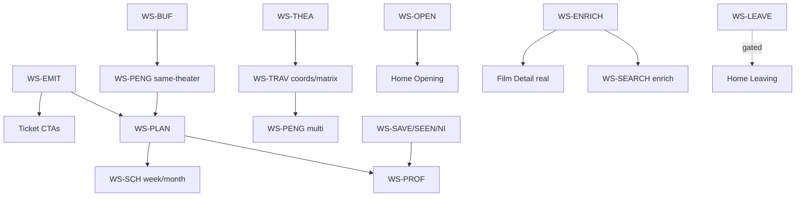

# Reel Seattle v2 — Stage 3 Front–Back Integration Roadmap

**Status:** Authoritative Stage 3 roadmap (documentation only)  
**Date:** 2026-07-24  
**Authority:** Integration sequencing for Stage 4; does **not** authorize implementation by itself  
**Approved decisions:** [v2-stage-3-product-decisions.md](./v2-stage-3-product-decisions.md) (D01–D17 approved)  
**Stage 2 inventory:** [v2-data-and-backend-needs-audit.md](./v2-data-and-backend-needs-audit.md)  
**Data foundation:** [data-foundation-roadmap.md](../data-foundation-roadmap.md)  
**Design preservation:** See §2 — *Remove fake production values, not designed capabilities.*

This roadmap tells Stage 4 **what to connect, in what order, while preserving approved mockups**. It does not implement systems, change fixtures used as visual truth, or simplify designs.

---

## 1. Executive summary

### Approved target architecture (initial usable v2)

| Layer | Role |
|-------|------|
| **Generated public JSON** (GitHub Actions → Pages) | Showtimes window, newly_added, pipeline_report, theaters deploy copy, **new** opening artifact, **later** leaving (gated), **later** selective enrichment |
| **Repository-curated data** | Theater visit metadata (address/geo/website/description/screens/capabilities/amenities/imagery); curated opening overrides; curated collections/tags; walk matrix (later) |
| **Browser-local persistence** (versioned stores) | Save, Seen, NI, favorites, planner drafts/plans, Schedule, settings, profile/membership prefs, recent searches; export/import later |
| **Client-derived** | Top Opportunity mechanical ranking, Best Way (distance suppressed until travel), evidence tiles, search over HomeData, copy templates, buffer policy, same-theater planner |
| **Historical / offline derivation** | Opening dates from history; Leaving Soon evaluation; coverage reports |
| **Later / optional server** | Accounts, one-way calendar OAuth, routing API, push/email — **not** initial critical path |
| **Visual fixtures** | Retain forever for regression (`filmDetailMockupFixture`, `homeVisualFixtures`, FD visual fixtures) |
| **Production fixtures** | Must leave production paths (Film Detail mockup-as-default is the largest current production fixture dependence) |

### Deliberately deferred (not blockers)

Leaving Soon ship; Letterboxd/cultural ranks; person/cast search; pricing/hours; multi-theater miles until matrix; one-way calendar sync; live A-List; notifications; budget; genre coloring; external enrichment provider selection; new venues; accounts.

### How designs are preserved

Every unsupported field keeps its **component slot, model contract, ordering, and canonical visual fixture**. Production **suppresses values** (and sometimes whole sections) without deleting structure. Reactivation tasks + tests prove the slot still exists. Stage 5 only after investigation gates in §25.

### Fixture retirement without deleting visual truth

- **Production path** stops reading idealized film/venue values.  
- **Canonical visual fixtures** remain behind explicit QC flags / test harnesses.  
- **Fixture-leak tests** fail CI if production bundles or default surfaces still serve mockup titles as live data.

---

## 2. Design-preservation contract

For every approved field/section that cannot initially be populated in production, Stage 4 tasks must document:

| Contract field | Required content |
|----------------|------------------|
| Approved page | Mockup / surface |
| Approved component | React component or named region |
| Location / ordering | Position in composition |
| Model slot | Field on presentation/model object (may be `null`) |
| Production visibility | Predicate (e.g. `value != null && gate`) |
| Temporary layout | Collapse gap / keep fixed region |
| Missing-data fallback | Copy or silence |
| Canonical visual fixture | File + mode |
| Owning workstream | `WS-*` |
| Supplying task | Creates data |
| Reactivation task | Turns visibility on |
| Reactivation acceptance | Functional proof |
| Visual regression | Against canonical mockup/fixture |
| Fixture-leak prevention | Production must not show fixture values |

**Hard rules**

1. Suppression must **not** delete the component.  
2. Suppression must **not** redesign surrounding UI.  
3. Suppression must **not** remove the field from the model contract.  
4. Production fixtures must **not** fill unsupported values.  
5. Canonical fixtures **may** remain for visual regression.  
6. Future data tasks **reactivate** existing elements — they do not recreate designs.

**Ledger shorthand used below:** `PRESERVE(slot)` = contract retained; `SUPPRESS(prod)` = hidden in production; `ACTIVATE(task)` = reactivation owner.

---

## 3. Architecture boundaries

| Boundary | Owner | Inputs | Outputs | Cadence | Validation | Consumers | Failure | Initial scope? |
|----------|-------|--------|---------|---------|------------|-----------|---------|----------------|
| `showtimes_current.json` | Pipeline / emit | History + logs | Films/showtimes | Daily | Schema + public validators | Home, Explore, Planner, FD | Stale/empty per source | **Yes** |
| `newly_added_current.json` | Emit | Announcements | Entries | Daily | Schema | Home provisional only until Opening | Empty OK | **Yes** (not Opening) |
| `pipeline_report.json` | Pipeline | Sources | Health | Daily | Schema | Dev/status | Soft | **Yes** |
| `leaving_soon_current.json` | Emit research | History | Risk items | Daily | Schema | **None until gate** | Review-only | Eval only |
| **New** `opening_this_week_current.json` (name TBD) | New job | History + overrides | Opening membership | Daily | New schema | Home, Opening page | Empty → unavailable shelf | **Yes** (after WS-OPEN) |
| Theater registry + curated visit meta | Authored JSON | Curator | Expanded theaters | On edit | Schema + sync to public | Theater pages, Search, Directions | Missing fields → suppress sections | **Yes** |
| Opening override file | Curator | Manual | Overrides | Rare | Provenance required | Opening job | Ignore bad rows | **Yes** |
| Walk matrix (later) | Curator | Coords | N×N minutes/mi | Rare | Completeness | Planner multi | Suppress miles | Phase later |
| AMC source catalog | Internal | AMC | Products | Daily soft-fail | Catalog validators | Enrichment research | Soft-fail retain | Internal |
| Public enrichment artifact (optional) | Emit / research | Catalog and/or external | Year/genres/… | Daily/on match | Schema + attribution | FD, Search, Opening | Partial OK | After terms |
| Browser-local stores | v2 client | User | Versioned JSON | Live | Migration tests | Profile, Schedule, Planner | Corrupt → reset w/ warning | **Yes** |
| Client selectors / evidence / copy | v2 client | HomeData + stores | Presentation | On load | Unit tests | Surfaces | Honest empty | **Yes** |
| Planner engine | Client | Showtimes + config + buffers | Plans | On demand | Validity tests | Build a Plan, Schedule | Empty results | **Yes** same-theater |
| Visual fixtures | Repo | Design | QC presentation | — | Visual tests | `?fdVisual` / test only | N/A | **Retain** |
| Production fixtures | Must retire | — | — | — | Leak tests | **None** eventually | — | Retire FD default |
| Feature/data gates | Config/constants | Flags | Visibility | — | Tests | All surfaces | Fail closed | **Yes** |
| Accounts / OAuth calendar / routing API | Future | — | — | — | — | — | — | **No** |

---

## 4. Workstream inventory

| WS ID | Name | Stage 2 gaps | Notes |
|-------|------|--------------|-------|
| WS-EMIT | Public emit completeness | G05, G06 | ticket/purchase URL, source_showtime_id |
| WS-ATTR | Presentation attributes emit | G07, G28 | After P-18B; auditorium later |
| WS-FILMID | Canonical film identity | G02 | film_id + matching |
| WS-ENRICH | Film enrichment public | G01 | Partial OK; AMC terms research |
| WS-IMG | Film imagery | G23 | Poster gaps; backdrop |
| WS-THEA | Theater metadata curation | G08 | D06 first-release fields |
| WS-TIMG | Theater imagery | G08 | Rights | **Foundation complete 2026-07-28** — shared resolver + `/theater-images/` staging; venue photos still pending clearance |
| WS-FMT | Format taxonomy | P-001 family | Labels/icons; no fake 35mm |
| WS-OPEN | Opening This Week | G03 | Distinct from newly_added |
| WS-LEAVE | Leaving Soon | G04 | Eval + Pages gate |
| WS-EVID | Opportunity evidence | O-001/2, G16 | Schedule-safe first |
| WS-SEARCH | Search | G17 | Copy honesty; later people |
| WS-SAVE | Saved films | G10 | Local store |
| WS-SEEN | Seen films | G11 | Richer than keys |
| WS-NI | Not interested | G11 | |
| WS-FAV | Favorite theaters | G11b | |
| WS-PROF | Profile preferences | G14 deferred | Local identity |
| WS-MEM | Membership preferences | G19 | No live A-List |
| WS-PCFG | Planner configuration | G13 partial | Controls + suppress |
| WS-PENG | Planner engine | G13 | Same-theater → multi later |
| WS-BUF | Runtime/buffer policy | G26 | 15/10/5 |
| WS-PLAN | Plan persistence | G12 | Accepted plans |
| WS-SCHW | My Schedule week | G12 | |
| WS-SCHM | My Schedule month | G12, G25 | |
| WS-INS | Schedule insights | G25 | |
| WS-SETT | Schedule settings | — | Color modes |
| WS-CAL | Calendar export | G15 | ICS + one-time |
| WS-COLL | Collections / editorial | G18 | Hybrid |
| WS-SHARE | Sharing | G27 | URL/state |
| WS-XPORT | Local export/import | D01 | Later local-first |
| WS-ACCT | Account / auth boundary | G14 | **T-AUTH-01 + film/schedule cloud sync complete** — Google sign-in + profiles RLS; explicit attach for film prefs + accepted plans ([auth-foundation.md](./auth-foundation.md)); favorite-theater sync still deferred |
| WS-NOTIF | Notifications research | G20 | Deferred |
| WS-VENUE | Venue expansion | G22 | PO-prioritized DF |
| WS-TRAV | Travel / coords / matrix | G09 | Phased |
| WS-FIX | Fixture retirement | — | Production vs visual |
| WS-PRES | Design-preservation validation | — | Structure/leak tests |
| WS-S5 | Stage 5 review | G16 etc. | Gates only |

---

## 5. Dependency graph

### Narrative

Emit (WS-EMIT) unblocks ticket CTAs and sync keys everywhere. Enrichment research (WS-ENRICH) and theater curation (WS-THEA) run in parallel with local persistence (WS-SAVE/SEEN/NI/FAV/PLAN). Opening (WS-OPEN) needs history + override file; independent of Leaving. Planner same-theater (WS-PENG+BUF+PCFG) needs showtimes + buffers; multi-theater waits on WS-TRAV. Schedule (WS-SCH*) needs WS-PLAN. Film Detail production path leaves mockup fixture only after WS-ENRICH slots can activate honestly (many fields remain suppressed). Leaving (WS-LEAVE) and cultural ranks (WS-S5) never block earlier phases. Accounts (WS-ACCT) are documentation-only until post-MVP.

**Cycle break:** Film Detail visual fixture remains for QC while production uses real HomeData composer with suppressed nulls — no wait for full enrichment.

### Compact table

| WS | Hard prereqs | Soft | Gates |
|----|--------------|------|-------|
| WS-EMIT | Pipeline | — | Validation |
| WS-OPEN | History | Overrides | D02 |
| WS-THEA | Registry schema | Imagery rights | D06 |
| WS-ENRICH | Terms research for AMC republish | External research | D04 |
| WS-SAVE…FAV | Store contracts | film_id later | D01 |
| WS-PENG | Showtimes, WS-BUF | WS-EMIT | D08 |
| WS-TRAV | WS-THEA coords | — | D07 |
| WS-PENG multi | WS-TRAV matrix | — | D08 |
| WS-PLAN | WS-PENG or manual add | WS-EMIT | D01 |
| WS-SCH* | WS-PLAN | WS-CAL | D09, D14, D17 |
| WS-LEAVE Pages | Eval bar | — | D03 |
| WS-SEARCH people | WS-ENRICH | — | D12 |
| WS-FIX FD | WS-ENRICH path + PRESERVE | — | Leak tests |

---

## 6. Implementation phases

**Rhythm (every phase):** connect available real data → preserve/suppress unsupported slots → stop at next missing capability → supply capability → return to pages → reactivate → test → remove production fixture dependence for those fields → repeat.

### Phase 0 — Emit completeness + honesty baseline
- **Goal:** Public showtimes expose ticket/purchase URLs and source showtime IDs; production never uses FD mockup for “real” claims on those fields.  
- **WS:** WS-EMIT, WS-PRES, WS-FIX (partial), WS-SEARCH (copy)  
- **Mockups:** Film Detail tickets, Schedule Next Up, Opp scaffolds, Explore placeholder  
- **Activate:** ticket links when URL present; source IDs for future sync  
- **Suppress:** enrichment, distance, Letterboxd, Leaving, budget, genre colors  
- **Entry:** Approved D01–D17  
- **Exit:** Emit validated; Pages artifact non-null where source has URLs/IDs; leak tests for ticket fields  
- **Risks:** Purchase URL field naming (`purchase_url` vs `ticket_url`)  
- **Checkpoint:** PO confirms external ticket UX still “no checkout in-app”

### Phase 1 — Local-first stores + Profile/Explore activity skeleton
- **WS:** WS-SAVE, WS-SEEN, WS-NI, WS-FAV, WS-PROF, WS-MEM, WS-PRES  
- **Activate:** Save/Seen/NI/favorites persistence; Profile counts from stores; membership preference without renew/use  
- **Suppress:** renew date, weekly use, accounts, notifications  
- **Exit:** Versioned stores; migration tests; Film Detail actions write real stores (no Save unavailable stub)

### Phase 2 — Wire Film Detail + Search to real HomeData (suppress null enrichment)
- **WS:** WS-FIX (FD default), WS-EVID (schedule-safe), WS-SEARCH, WS-IMG (poster-only)  
- **Activate:** Real title/runtime/poster/showtimes/Best Way without miles; Why See It schedule signals  
- **Suppress:** year/rating/genres/director/synopsis/backdrop/Letterboxd/distance when null  
- **Fixtures:** Mockup fixture **visual-only**; production uses composer  
- **Exit:** Default FD surface does not import mockup presentation; visual fixture still QC-able

### Phase 3 — Theater curation first slice
- **WS:** WS-THEA, WS-TIMG, WS-FMT  
- **Activate:** Address, geo, website, directions, description, screens, capabilities, amenities, imagery when curated  
- **Suppress:** Pricing, hours sections  
- **Exit:** At least enabled theaters have address+coords+website; Theater Detail suppresses empty sections without deleting components

### Phase 4 — Opening This Week real artifact
- **WS:** WS-OPEN, copy ledger  
- **Activate:** Calendar-week Opening shelf/page from history+overrides  
- **Suppress:** None of Opening once artifact ships (empty → unavailable state)  
- **Exit:** Home no longer uses newly_added as Opening synonym; distinct copy from Explore This Week

### Phase 5 — Same-theater Planner v2 + buffers
- **WS:** WS-BUF, WS-PCFG, WS-PENG, WS-SHARE (criteria)  
- **Activate:** Config (supported controls), same-theater results, sorts subset, film-click prefs, suppress walk/budget/multi  
- **Exit:** Real results from `showtimes_current`; walk miles hidden; budget control disabled/hidden per D16

### Phase 6 — Plan persistence + My Schedule + ICS
- **WS:** WS-PLAN, WS-SCHW, WS-SCHM, WS-INS, WS-SETT, WS-CAL  
- **Activate:** Accept plan → Schedule week/month; insights; ICS; About copy without sync claims; genre color disabled  
- **Exit:** Full Schedule without accounts; calendar sync setting unavailable

### Phase 7 — Enrichment (partial) reactivation pass
- **WS:** WS-ENRICH, WS-FILMID (start), WS-IMG, WS-EVID  
- **Activate:** Fields with real coverage (AMC-first if rights OK)  
- **Suppress:** Still-null fields; Letterboxd  
- **Exit:** Coverage report; reactivation tests per field

### Phase 8 — Travel matrix + multi-theater planner
- **WS:** WS-TRAV, WS-PENG multi  
- **Activate:** Miles/walk when matrix edge exists  
- **Exit:** Multi-theater results only for validated edges

### Phase 9 — Collections hybrid + editorial light
- **WS:** WS-COLL, WS-SEARCH collections  

### Phase 10 — Leaving Soon eval → optional Pages
- **WS:** WS-LEAVE  

### Phase 11 — Export/import, share polish, Stage 5 gates
- **WS:** WS-XPORT, WS-SHARE, WS-S5, WS-NOTIF research doc  

Each phase lists product-review checkpoint when copy or legal terms change.

---

## 7. Page conversion ledger

Legend: **Avail** now = production-ready path exists · **Partial** · **Fixture** · **None**.  
**Layout:** C = collapse gap; K = keep region.

### 7.1 Home Landing
| Slot | Fixture/placeholder now | Avail | First real source | Intermediate | Vis condition | Layout | Visual fixture | Final source | WS | Block | Reactivate | Tests | Prod fixture gate |
|------|-------------------------|-------|-------------------|--------------|---------------|--------|----------------|--------------|----|-------|------------|-------|-------------------|
| Top Opp carousel | Real selector (not homeVisual film arrays) | Partial | `selectTopOpportunities` | Mechanical reasons | candidates.length | C | homeVisualFixtures QC only | + evidence | WS-EVID | — | T-EVID-02 | Interaction | Arrays never default |
| Landscape hero | Soft-wash poster | Partial | poster_url | Poster fallback | hasMedia | K | homeVisual | backdrop | WS-IMG | T-IMG-01 | T-IMG-02 | Visual | — |
| Theater · time | Real | Yes | opportunities | — | always | — | — | — | — | — | — | — | — |
| Runtime · genre | Runtime real; genre fixture-risk | Partial | runtime_min | Hide genre token | genre!=null | C | — | enrichment | WS-ENRICH | T-ENR-01 | T-ENR-10 | Leak | — |
| Reason line | Templates | Partial | reason codes | Soft templates | reason | C | — | evidence | WS-EVID | — | — | Copy | — |
| Opening shelf | Provisional newly_added | Partial | **Must stop** | Unavailable or banner | opening artifact | C | homeVisual | WS-OPEN | T-OPEN-01 | T-OPEN-10 | Home honesty | — |
| Leaving shelf | Gated empty | None | — | Unavailable shell | leave gate | C | homeVisual | WS-LEAVE | T-LEAVE-01 | T-LEAVE-10 | 404 allowlist | — |
| Planner CTA | Real nav | Yes | destinations | — | — | — | — | — | — | — | — | — | — |
| Explore More | Static rows | Yes | chrome | — | — | — | EXPLORE_MORE_ROWS OK as chrome | — | — | — | — | — | — |

### 7.2 Home inline expand
| Slot | Now | First real | Suppress until | WS | Reactivate |
|------|-----|------------|----------------|----|------------|
| Poster/title/runtime | Real | HomeData | — | — | — |
| Genre · rating · year | Null | Enrichment | each !=null | WS-ENRICH | T-ENR-11 |
| Synopsis | Null | Enrichment | synopsis | WS-ENRICH | T-ENR-12 |
| Next showtime · format | Real | opportunities | — | WS-FMT | — |
| New / also playing chips | Derived | counts | — | — | — |
| Save / NI | NI local; Save absent | WS-SAVE | Save store live | WS-SAVE | T-SAVE-03 |
| More details | Real | Film Detail | — | WS-FIX | T-FIX-FD-01 |

### 7.3 Explore landing
| Slot | Notes | WS | Reactivate |
|------|-------|----|------------|
| Search placeholder | Change copy — no “person” promise | WS-SEARCH | T-SEARCH-01 |
| Quick Start IMAX/35mm | IMAX partial; 35mm suppress collection if empty | WS-FMT | T-FMT-05 |
| Browse Collections/Coming Soon/Events | Unavailable scaffolds PRESERVE | WS-COLL | T-COLL-10 |
| Suggested Starts | Date windows real; imagery curated optional | WS-COLL | — |
| Film Activity counts | Enrich stores | WS-SEEN/NI | T-SEEN-02 |
| Recent searches | Exists | — | — |

### 7.4 Search Results
| Slot | Suppress until | WS | Reactivate |
|------|----------------|----|------------|
| Year/genre/synopsis/director/language | enrichment fields | WS-ENRICH | T-ENR-20 |
| Next showtime / also playing | available now | — | — |
| Classic tag | classifier | WS-EVID | T-EVID-05 |
| Theater address/thumb | WS-THEA | WS-THEA | T-THEA-10 |
| Save | WS-SAVE | WS-SAVE | T-SAVE-03 |
| Person matches | never until D12 | WS-SEARCH | T-SEARCH-20 |

### 7.5 Film Detail
| Slot | Production now | Target | Suppress | Visual fixture | Reactivate |
|------|----------------|--------|----------|----------------|------------|
| Entire page data | **Real HomeData composer** | QC: `?fdMockup=1` / `?fdVisual=1` | null fields suppressed | Keep mockup + fdVisual | **T-FIX-FD-01 Complete** |
| Backdrop | Fixture | poster soft-wash / later backdrop | no backdrop | Keep | T-IMG-02 |
| Year/rating/genres/director | Fixture | enrichment | each | Keep | T-ENR-30… |
| Letterboxd badge | Fixture | deferred | always until S5 | Keep evidence tile | T-S5-LB |
| Why See It tiles | Fixture ranks | schedule-safe types | empty types | Keep grid | T-EVID-10 |
| Synopsis + thematic tags | Fixture | synopsis; tags curated only | null / no invented tags | Keep | T-ENR-12 / T-COLL-05 |
| Best Way distance | Fixture 0.6 mi | suppress until matrix | distance fact only | Keep card | T-TRAV-10 |
| A-List badge | Fixture | eligibility when known | unknown | Keep | T-MEM-02 |
| Actions Save/Seen/NI/Planner | Partial | full local | — | — | T-SAVE-03 |

### 7.6 Opening This Week page
| Slot | Source | WS | Reactivate |
|------|--------|----|------------|
| Count / sort by opening date | WS-OPEN artifact | WS-OPEN | T-OPEN-10 |
| Year/genres/synopsis | Enrichment | WS-ENRICH | T-ENR-11 |
| Why / also playing / Save | evidence + stores | WS-EVID, WS-SAVE | — |

### 7.7–7.8 Theaters list & detail
| Section | First release | Suppress | Reactivate |
|---------|---------------|----------|------------|
| Name/type/program | Registry + showtimes | — | — |
| Address/geo/website/directions/description/screens/capabilities/amenities/imagery | Curated | if missing | T-THEA-10 |
| Pricing | — | **section** | T-THEA-40 (Stage 5/later) |
| Hours | — | **section** | T-THEA-41 |
| Favorite | WS-FAV | until store | T-FAV-01 |
| Screen tabs / reserved | attrs later | until WS-ATTR | T-ATTR-10 |

### 7.9 Planner landing
| Slot | Source | Suppress |
|------|--------|----------|
| Upcoming plans | WS-PLAN | empty state |
| My Schedule / Build CTAs | nav | — |
| Recent Activity | derive from stores or light log | until WS optional |

### 7.10–7.12 Build a Plan config / results / film sheet
| Control / fact | Phase 5 visible? | Notes |
|----------------|------------------|-------|
| Presets, when, must/would/NI, theater prefs, gaps, formats, events, repeats, sold-out | Yes | Map to engine |
| Walk distance control | Hidden/disabled | Until WS-TRAV |
| Budget | Hidden/disabled | D16 |
| Prefer AMC / A-List weight | Preference only | D10 |
| Result walk miles | Suppressed | Until matrix |
| Multi-theater chains | No | Until Phase 8 |
| Breaks / duration / finish | Yes | WS-BUF |
| Film-click Must/Would/Neutral/NI/Replace | Yes | Mutation scope task |
| Result card structure | **Always preserved** | Even if same-theater only |

### 7.13–7.16 My Schedule (+ settings + About)
| Slot | Activate | Suppress |
|------|----------|----------|
| Week/month/plans/breaks | WS-PLAN | travel segments until matrix |
| Color by opportunity | Default | — |
| Color by theater | When mapping exists | — |
| Color by genre | Disabled | Until genres reliable |
| Calendar sync setting | Disabled / unavailable | Until one-way sync (not initial) |
| ICS / Add to Calendar | Phase 6 | — |
| About copy | Must not claim sync | Update task T-CAL-01 |
| Insights | From plans | — |

### 7.17 Profile
| Slot | Activate | Suppress |
|------|----------|----------|
| Local name/location prefs | WS-PROF | accounts |
| Counts | stores | — |
| Up Next | WS-PLAN | — |
| Favorite theaters | WS-FAV + imagery | — |
| Membership card | Preference + eligibility | renew, weekly use |
| Notifications etc. | Placeholders / local prefs | push/email |

---

## 8. Copy conversion ledger

| Copy ID | Location | Example | Inputs | WS | Initial fallback | Final template | Plural | Rel date | TZ | Missing | Confidence | Suppress | Reactivate | Tests |
|---------|----------|---------|--------|----|------------------|----------------|--------|----------|----|---------|------------|----------|------------|-------|
| C-TODAY | many | Today | date, nowPT | — | absolute date | Today | — | calendar day | PT | abs | — | — | — | unit |
| C-TONIGHT | Home/Search | Tonight | date+time | — | Today + time | Tonight if evening heuristic | — | yes | PT | Today | — | optional | — | unit |
| C-TOM | many | Tomorrow | date | — | abs | Tomorrow | — | yes | PT | abs | — | — | — | unit |
| C-OPEN-WEEK | Opening | Fri 5/18 | openingDate | WS-OPEN | hide | weekday+short | — | — | PT | hide | — | no artifact | T-OPEN-10 | unit |
| C-ROLL-WEEK | Explore | This Week | rolling7 | WS-SEARCH | — | distinct from Opening | — | — | PT | — | — | — | T-SEARCH-01 | copy |
| C-OPEN-N | Opening | 18 films opening | n | WS-OPEN | No films… | `{n} films opening…` | film/films | — | — | empty | — | — | T-OPEN-10 | unit |
| C-LEAVE-END | Leaving | Ends May 19 | endDate, conf | WS-LEAVE | unavailable | soft if low conf | — | — | PT | hide | required | gate | T-LEAVE-10 | unit |
| C-LEFT-N | Why See It | 3 screenings left | n | WS-EVID | hide | `{n} screenings left` | yes | — | — | hide | — | n unknown | T-EVID-10 | unit |
| C-ONLY | Why/Best | Only at SIFF… | venueCount | WS-EVID | hide | Only at {name} | — | — | — | hide | — | count≠1 | — | unit |
| C-VENUES | Why | Only 3 venues | n | WS-EVID | hide | Only {n} venues… | yes | — | — | hide | — | — | — | unit |
| C-ALSO | Search/Opening | Also playing at 2 | n | — | hide | Also playing at {n}… | yes | — | — | hide | — | — | — | unit |
| C-NEXT | expand | SIFF · Tonight · 35mm | theater,time,fmt | — | No upcoming | template | — | yes | PT | empty | — | — | — | unit |
| C-RARE | Why | Rare 70mm | format | WS-FMT | hide | Rare {label} | — | — | — | hide | — | — | — | unit |
| C-RES-N | Search | 18 results for ‘q’ | n,q | WS-SEARCH | No results | `{n} results for '{q}'` | yes | — | — | empty | — | — | — | unit |
| C-PLAN-N | Results | 18 plans found | n | WS-PENG | No plans | `{n} plans found` | yes | — | — | empty | — | — | — | unit |
| C-DUR | Results | 9h 47m total | min | WS-BUF | — | h/m | — | — | — | — | — | — | — | unit |
| C-BREAK | Results | Break 1h 16m | gap | WS-BUF | hide if setting | Break {dur} | — | — | — | — | — | — | — | unit |
| C-WALK | Results/Best | 2.2 mi walk | mi | WS-TRAV | **suppress** | {mi} mi walk | — | — | — | suppress | — | no matrix | T-TRAV-10 | unit |
| C-FINISH | Results | Finishes 10:42 PM | end | WS-BUF | — | Finishes {time} | — | — | PT | — | — | — | — | unit |
| C-ALIST-ELIG | FD | A-List eligible | flag | WS-MEM | hide | A-List eligible | — | — | — | hide | high only | unknown | T-MEM-02 | unit |
| C-ALIST-USE | Profile | 4 of 4 | — | WS-MEM | **suppress** | — | — | — | — | suppress | — | until supported | T-S5-ALIST | leak |
| C-EMPTY-DAY | Schedule | No plans yet… | — | WS-SCHW | static | static | — | — | — | — | — | — | — | — |
| C-CHANGED | Schedule | Showtime changed | status | WS-PLAN | omit if unknown | template | — | — | PT | omit | — | — | — | unit |
| C-CANCEL | Schedule | Canceled | status | WS-PLAN | omit | template | — | — | — | omit | — | — | — | unit |
| C-DONE | Schedule | Completed | status | WS-SETT | dim/hide | per setting | — | — | — | — | — | — | — | unit |
| C-INSIGHT | Month | 8 movie days · … | aggs | WS-INS | hide section | templates | yes | — | — | empty | — | no plans | — | unit |
| C-FAV-N | Profile | — | n | WS-FAV | 0 | counts | — | — | — | 0 | — | — | — | unit |
| C-ACT-N | Profile/Explore | Seen 83 | n | WS-SEEN | 0 | counts | — | — | — | 0 | — | — | — | unit |
| C-PERSON | Explore | placeholder | — | WS-SEARCH | title/theater/keyword | no person | — | — | — | — | — | — | T-SEARCH-01 | copy |
| C-ABOUT-SYNC | About | sync claims | — | WS-CAL | ICS-only wording | update | — | — | — | — | — | until one-way | T-CAL-01 | copy |

---

## 9. Public data and emit roadmap

| Step | Data | Captured? | Normalized? | Emitted? | Browser? | Prod-ready? | Task |
|------|------|-----------|-------------|----------|----------|-------------|------|
| 1 | `source_showtime_id` | Yes (logs/history) | Yes | **Yes** (T-EMIT-01) | Yes when present | Production-ready where captured | T-EMIT-01 **Complete** |
| 2 | Purchase/ticket URL | Yes (AMC attrs `purchase_url` / `mobile_purchase_url`; indie varies) | Yes (history `ticket_url`) | **Yes** (T-EMIT-02) | Yes when present | Production-ready where captured | T-EMIT-02 **Complete** |
| 3 | `attributes` / presentation | Logs | Partial | `{}` | No | After P-18B + contract | T-ATTR-01 (DF) |
| 4 | Schema bump? | Prefer additive nullable fills without break | — | validate | consumers tolerate null→string | T-EMIT-03 |
| 5 | Size/privacy | URLs public OK; no PII | — | monitor artifact size | — | T-EMIT-04 |
| 6 | Missing-source | null ticket OK; CTA suppressed | — | — | PRESERVE button slot | T-EMIT-05 |

Cross-ref DF: emit completeness Planned rows — Stage 3 tasks **are** the consumer-facing sequencing; DF retains producer ownership.

---

## 10. Film identity and enrichment roadmap

1. Keep `showtime_film_key` as schedule join key.  
2. Design `film_id` + provenance (WS-FILMID) — parallel, not blocking Phase 2.  
3. Public enrichment artifact optional fields: year, rating, genres, directors, synopsis, backdrop URLs, attribution.  
4. **AMC republish research** (terms) before promoting catalog fields — gate G-ENR-AMC.  
5. External provider = research track only (no selection in Stage 3).  
6. Partial coverage OK; suppress nulls; PRESERVE slots.  
7. Programs/non-film entities: do not force TMDB match.  
8. Director index after directors public; cast later (D12).  
9. Page activation: T-ENR-10…30 series.  
10. Roadmap remains valid if external enrichment delayed (Phase 2 still ships).

---

## 11. Theater curation roadmap

- Expand authored registry (or sibling `theater_visit_meta.json`) with D06 fields.  
- Owner: product curator; review: address/geo semi-annual; amenities semi-annual; imagery on change.  
- Stale: hide section or “verify on site” — never invent.  
- Automation may **warn**, not overwrite.  
- Coords required before WS-TRAV.  
- Inferred capabilities from showtimes = advisory vs curated.  
- **Suppressed sections Phase 3+:** Pricing, Hours (components remain).  
- New venues: WS-VENUE / DF PO pick — not silent.

---

## 12. Format and presentation roadmap

- Map `format_tags` → display labels/icons (WS-FMT).  
- Do **not** claim 35mm when snapshot has zero tags.  
- Taxonomy parents (IMAX family) after evidence.  
- presentation_attributes after P-18B (DF Deferred).  
- Language/subs/events/Q&A/reserved/auditorium from attrs when emitted.  
- Best Way / filters / schedule colors consume taxonomy.  
- Unknown → omit badge, don’t invent.

---

## 13. Opening This Week roadmap

- Job: earliest scheduled Seattle showtime from **history** (+ current).  
- Calendar week membership (D02).  
- Override file + provenance.  
- Handle repertory/re-release/festival via overrides + flags.  
- Artifact daily; validate; Home/Opening activate (T-OPEN-10).  
- Copy distinct from Explore rolling week (C-ROLL-WEEK).  
- **Never** equate to `newly_added_current`.

---

## 14. Leaving Soon roadmap

1. Keep review artifact off Pages allowlist.  
2. Define eval bar (precision over recall; false positives worse).  
3. AMC-only candidate after bar.  
4. Confidence-aware copy (C-LEAVE-END).  
5. Then Pages gate + Home reactivation (T-LEAVE-10).  
6. Planner sort / notifications only after ship.  
7. Multi-source = research.  
8. Stage 5 if bar never met — shelf stays unavailable shell (component preserved).

---

## 15. Opportunity evidence roadmap

**Min contract:** type, subject refs, facts{}, provenance, confidence, observed_at, expires_at, copy_template_id, rank_weight?, personalized?, suppress_rule.

**Initial types:** newly_added, premium_format, limited_venues, screenings_left, special_screening, exclusivity, favorite_theater_match, membership_elig, seen_exception (D15).

**Deferred types:** Letterboxd/cultural ranks (PRESERVE tile; SUPPRESS type).

Top Opportunity / Why See It / Best Way share contract; distance fact separate travel gate.

---

## 16. Search roadmap

1. Title/theater/format (exists)  
2. **T-SEARCH-01** honest placeholder (no person)  
3. Enriched fields when present  
4. Director search post-enrichment  
5. Cast later  
6. Collections when WS-COLL  
7. Alt titles / fuzzy optional  
8. Dedicated index only if scale/people demand  

Preserve entity grouping UI for future people section (empty/hidden).

---

## 17. Local-first persistence roadmap

**Stores (versioned):** recentSearches (exists), savedFilms (v1), seenFilms (v1), notInterested (v1), favoriteTheaters (v1), plannerDrafts, plannerPrefs, acceptedPlans, scheduleSettings, profilePrefs, membershipPrefs.

**Identity before film_id:** store `showtime_film_key` + optional `source`/`source_film_id`; alias map on migration when film_id arrives.

**Export/import:** WS-XPORT later phase; portable JSON.

**Clear-data / privacy docs:** required.

**Accounts:** **`T-AUTH-01` complete** — Supabase Google auth + `profiles` RLS foundation. **Film preference sync + schedule (accepted plans) sync complete** with explicit per-browser attach (D01 preserved: login alone does not sync). Favorite-theater cloud sync still deferred.

---

## 18. Planner roadmap (sequenced)

1. Audit/preserve legacy same-theater engine  
2. WS-BUF constants 15/10/5  
3. v2 config contract (must/would/neutral/NI, dates, prefs)  
4. Map controls; **suppress** walk + budget  
5. Real same-theater results + approved cards  
6. Sorts (legacy ∩ mockup); refine panel supported knobs  
7. Film-click mutations + scope rules  
8. Persist accepted plans → Schedule  
9. Coords → matrix → multi-theater → travel segments → **reactivate walk UI**  

**Visible Phase 5:** config (minus walk/budget), results without miles, breaks, finish, formats.  
**Disabled:** budget, walk max, A-List live.  
**Preserved hidden:** multi-theater structure fields on model (`travelSegments: []`).

---

## 19. My Schedule roadmap

Entities per Stage 2 §16.B; local-only. Week/month projections; open-time search; Next Up; heatmap; insights; settings (genre color disabled); About (no sync claim); ICS + one-time add; one-way sync boundary documented only.

---

## 20. Profile roadmap

Local identity; activity counts; Up Next; favorites; A-List preference + eligibility; suppress renew/use; settings placeholders; future account migration notes. Layout preserved.

---

## 21. Collections and editorial roadmap

Rule-generated (formats, openings, events when attrs exist) + small curated JSON; curated tags only; ownership required; no invented themes; Coming Soon from enrichment/release when available; search integration later; no admin CMS initially.

---

## 22. Calendar and sharing roadmap

| Capability | Initial? | Backend? | UI |
|------------|----------|----------|-----|
| ICS export | Yes | No | Active |
| One-time Add to Calendar | Yes if practical | No | Active |
| One-way sync | Later | Yes OAuth | Setting preserved disabled |
| Bidirectional | **Out** | — | Never unless policy change |
| Film/theater/plan/criteria share | URL state phased | No | Preserve share affordances |

---

## 23. Fixture-retirement register

| Fixture ID | File | Category | Consumers | UI | Replacement | Phase | Prod vis | Retained visual? | Deletion gate | Leak test | Structure test |
|------------|------|----------|-----------|-----|-------------|-------|----------|------------------|---------------|-----------|----------------|
| FX-FD-MOCK | filmDetailMockupFixture.js | Prod retired | `?fdMockup=1` / storage only | FD page | composer+HomeData | 2 | real only | **Yes** QC | T-FIX-FD-01 **Complete** | yes | yes |
| FX-FD-VIS | filmDetailVisualFixtures.js | Canonical visual | `?fdVisual` | FD | — | — | QC only | **Yes** | never delete | flag-only | yes |
| FX-HOME-VIS | homeVisualFixtures.js | Canonical visual | tests | Home shelves | real shelves | — | test only | **Yes** | never as default | smoke | yes |
| FX-HOME-EXPLORE-ROWS | EXPLORE_MORE_ROWS | Chrome OK | ExploreMore | labels | — | — | OK | Yes | — | — | — |
| FX-PLACEHOLDER-MEDIA | placeholderMedia.js | QC | fixtures | — | real media | — | QC | Yes | — | — | — |
| FX-CONTRACT-* | model null slots | Contract | all | slots | enrichment etc. | per field | suppress | N/A | per T-ENR-* | yes | yes |

---

## 24. Testing and validation strategy

- Schema + `validate_public_data_artifacts` + coverage scripts  
- Unit: buffers, PT dates, calendar vs rolling week, pluralization, confidence copy, planner validity, store migrations  
- Integration: page activation, ticket CTA, Opening artifact  
- Visual: canonical mockups / fixtures  
- **Hidden-component structure tests** + **reactivation tests** + **fixture-leak** + smoke_check_v2 + a11y/responsive  
- Partial-source + stale + canceled showtime tests  

Prove for each suppressed field: (1) not shown without data; (2) contract/fixture remain.

---

## 25. Stage 5 decision gates

| Feature | Investigate | Alternatives | Evidence | Temp state | Preserve UI | Decide when | Retain / modify / defer |
|---------|-------------|--------------|----------|------------|-------------|-------------|-------------------------|
| Letterboxd/ranks | Licensing | Schedule evidence | Legal memo | Suppress type | Evidence tile | After terms research | |
| Person search | Enrichment | Copy change | Index feasibility | No person promise | Entity model | Post-enrichment | |
| Pricing/hours | Ownership SLA | Hide sections | Cadence plan | Suppress sections | Section components | When SLA defined | |
| Multi-theater routing API | Cost/ToS | Matrix | Usage need | Same-theater/matrix | Travel fields | After matrix | |
| Walk miles | Matrix quality | Suppress | Validation | Suppress fact | Fact slot | Matrix complete | |
| One-way calendar sync | OAuth need | ICS | User demand | Setting disabled | Sync row | Post-MVP | |
| Bidirectional | Policy conflict | Never | — | Out of scope | — | Only if PO changes About | |
| Live A-List | ToS | Prefs | — | Suppress counters | Membership card | Unlikely | |
| Notifications | Channels | Local only | Demand | Placeholder | Menu rows | Research doc | |
| Genre coloring | Genre coverage | Opp-type default | Coverage % | Disable option | Option UI | Coverage gate | |
| Budget | Price coverage | Hide control | Coverage | Hidden | Control contract | Coverage gate | |
| A11y filters | Attrs emit | Hide filters | Attr coverage | Suppress | Filter slots | WS-ATTR | |
| Sold-out reliability | Cadence | Soft copy | Metrics | Prefer exclude w/ caveat | Toggle | Ongoing | |
| 35mm | Source tags | Honest empty | Snapshots | Empty collection | Quick Start slot | When tags exist | |
| New venues | PO pick | Registry only | — | Real venues only | Theater pages | DF track | |

---

## 26. Task catalog (Stage 4-ready)

Difficulty A–F as Stage 2. `Indep` = Cursor may execute with tests; `PO` = product review; `Ext` = external research.

### Emit & identity
| ID | Title | Scope | Deps | Gaps | WS | Mockups | Activate | Still suppress | Fixtures | AC / tests | Non-goals | Diff | Risk | Indep | PO | Ext |
|----|-------|-------|------|------|----|---------|----------|----------------|----------|------------|-----------|------|------|-------|----|-----|
| T-EMIT-01 | Emit source_showtime_id | Map logs→public; validate | — | G06 | WS-EMIT | FD/Schedule/sync | IDs when present | attrs | — | non-null where log has; schema; size | presentation_attrs | B | L | Y | N | N | **Complete 2026-07-24** — `source_showtime_id_from_history_row` → emit; local regen `public/data/showtimes_current.json` (ref 2026-07-20): 3049/3075 non-null (99.2%); NWFF remains null (no native ID); no schema bump |
| T-EMIT-02 | Emit ticket/purchase URLs | Normalize to ticket_url | T-EMIT-01 soft | G05 | WS-EMIT | FD, Next Up, Opp | CTA when URL | checkout | — | CTA opens external; null hides label not button shell | in-app pay | B | L | Y | Y | N | **Complete 2026-07-24** — history `ticket_url` column + `ticket_url_from_raw`/`ticket_url_from_history_row` → emit; AMC purchase→ticket; Central/NWFF `ticket_url_raw`; SIFF/Beacon null; local regen (ref 2026-07-20): 2939/3075 (95.6%); NWFF film-level Eventive pages documented as source-provided fallback; no schema bump; no emitter→daily-log bypass |
| T-EMIT-03 | Consumer tolerance + docs | Adapter mapping | T-EMIT-02 | G05 | WS-EMIT | all ticket | — | — | — | tests | redesign | B | L | Y | N | N | **Complete 2026-07-24** — `ticketUrl` via HomeData; shared `externalTicketUrl` helpers; Opportunity scaffold + legacy TopOpportunityCard wired; live Home Top Opportunity / inline / Search / FD surfaces intentionally without new CTAs (model ready); null suppresses action (scaffold keeps honest note); no sourceUrl fallback; SIFF/Beacon null honest; NWFF Eventive URLs not claimed performance-specific; fixtures retained; T-FIX-FD-01 not started |
| T-SEARCH-01 | Honest search placeholder | Remove person promise | — | G17 | WS-SEARCH | Explore | copy | people | — | copy tests; personSearch false | person index | A | L | Y | Y | N | **Complete 2026-07-24** — canonical placeholder `Search movies, theaters, and formats` (`v2/explore/searchCopy.js`); Explore + Search Results wired; counts/empty states deterministic; people/collections groups preserved empty+hidden; personSearchSupported false; no person/cast/director index |
| T-CAL-01 | Calendar export contract | ICS event model | T-BUF-01 soft | G15 | WS-CAL | FD,Planner,Schedule | .ics file | sync/OAuth | — | unit ICS+UID | UI wire T-CAL-02 | C | L | Y | N | N | **Complete 2026-07-25; end semantics aligned 2026-08-22** — `src/utils/calendarExport.js`: showtime/plan → normalized events → ICS; start=advertised; end=start+runtime via buffer policy (no universal preshow); missing runtime fails; UID = public id → source+source_showtime_id → film+theater+start; plan = one event/film, fail-closed; local-only; UI wiring deferred; sync still deferred |
| T-BUF-01 | Buffer policy module | transfer 10/5; scheduling end = start+runtime | — | G26 | WS-BUF | Planner, Schedule | shared end times | theater-specific | — | unit parity UI/engine | user adjust / screening-specific trailer | C | L | Y | N | N | **Complete 2026-07-25; revised 2026-08-22** — `plannerBufferPolicy.js`: scheduling end = advertised start + runtime (universal +15m preshow removed — cancels for relative chaining without screening-specific trailer data); same canonical `theater_id` → 5m else 10m; missing runtime → indeterminate; wired into `plannerEngine` + v2 hard constraints / Results. Screening-specific trailer modeling deferred (PLAN-12). |
| T-FIX-FD-01 | FD production leaves mockup | Default→composer real; suppress nulls | T-EMIT-02 soft | G01 | WS-FIX | FD | real schedule fields | enrich/Letterboxd/mi | retain FX-FD-MOCK visual | leak+structure+visual QC | redesign FD | D | M | Y | Y | N | **Complete 2026-07-24** — production uses `resolveFilmDetailPresentation` → composer; mockup only via `?fdMockup=1`; visual via `?fdVisual=1`; unknown film = not-found (no fixture fallback); activated: title/runtime/poster/formats/showtimes/Best Way/schedule evidence/ticketUrl slots; suppressed: year/rating/genres/director/synopsis/Letterboxd/distance/thematic tags; Save honestly unavailable; fixtures retained; Playwright QC requires Chromium |
| T-SAVE-01 | Saved films store v1 | versioned localStorage | D01 | G10 | WS-SAVE | FD,Search,Home | Save on/off | sync | — | migrate/persist | accounts | C | L | Y | N | N | **Complete 2026-07-24** — `v2/stores/savedFilmsStore.js` versioned `{version:1,items:[{filmRef,savedAt,...}]}`; identity via `showtimeFilmKey` (+ future nullable `filmId`); get/isSaved/save/unsave/toggle/clear; corrupt→empty; unsupported future version refuses writes; no UI wiring (T-SAVE-03); not seeded by fixtures |
| T-SEEN-01 | Enrich Seen store | dates optional | — | G11 | WS-SEEN | Explore,FD,Profile | counts | theater always | — | caps/migrate | accounts | C | L | Y | N | N | **Complete 2026-07-24** — `v2/stores/seenFilmsStore.js` versioned `{version:1,items:[{filmRef,seenAt,seenAtSource?,showtimeRef?}]}`; key `reel-seattle.v2.seenFilms`; legacy string[] migrates in-memory on read, persists v1 on intentional write; identity via shared Saved filmRef helpers / `filmRefFromHomeFilm`; generic toggles = record time (`user-recorded`), no fabricated showtimeRef; Explore key helpers remain compatible; Profile counts / D15 ranking / T-NI-01 deferred |
| T-SEEN-03 | Wire Seen UX | buttons | T-SEEN-01 | G11 | WS-SEEN | FD | actions | ranking | — | no false success | Profile | B | L | Y | N | N | **Complete 2026-07-24** — FD action-row Seen wired via `buildSeenActionState` / `applySeenToggle`; shared `filmRefFromHomeFilm`; confirmed-write; QC modes visual-only; no showtimeRef; Search/inline deferred (no Seen control); independent of Saved/NI; Film Activity keys refresh from same store |
| T-NI-01 | Enrich NI store | — | — | G11 | WS-NI | same | — | — | — | — | — | C | L | Y | N | N | **Complete 2026-07-24** — `v2/stores/notInterestedFilmsStore.js` versioned `{version:1,items:[{filmRef,markedAt,markedAtSource?,reason:null,title?,posterUrl?}]}`; key remains `reel-seattle.v2.dismissedFilms`; legacy string[] migrates in-memory on read, persists v1 on intentional write; identity via shared Saved filmRef helpers / `filmRefFromHomeFilm`; Explore `dismissedFilmsStore` helpers remain compatible; FD NI wiring / Profile counts / ranking / management deferred |
| T-NI-03 | Wire NI UX | buttons | T-NI-01 | G11 | WS-NI | FD | actions | ranking | — | no false success | Profile | B | L | Y | N | N | **Complete 2026-07-24** — FD action-row Not interested wired via `buildNotInterestedActionState` / `applyNotInterestedToggle`; shared `filmRefFromHomeFilm`; confirmed-write; `reason: null`; QC modes visual-only; Search/Collection keep shim dismiss helpers (same store); inline deferred; independent of Saved/Seen; Film Activity keys refresh from same store; Profile counts / management / D15 ranking deferred |
| T-FAV-01 | Favorite theaters store | — | — | G11b | WS-FAV | Theaters,Profile | star | — | — | — | — | C | L | Y | N | N | **Complete 2026-07-25** — `v2/stores/favoriteTheatersStore.js` versioned `{version:1,items:[{theaterRef:{theaterId,sourceTheaterId?,source?},favoritedAt,name?,imageUrl?,neighborhood?}]}`; key `reel-seattle.v2.favoriteTheaters`; v1 is first format (no legacy migrate); identity = canonical registry `theaterId` (SIFF locations distinct); get/isFavorite/favorite/unfavorite/toggle/clear; corrupt→empty; unsupported future version refuses writes; no UI wiring / Profile counts / Planner ranking (deferred) |
| T-SAVE-03 | Wire Save UX | buttons | T-SAVE-01 | G10 | WS-SAVE | many | actions | — | — | no “unavailable” | — | B | L | Y | N | N | **Complete 2026-07-24** — FD header+action row + Search expanded Save wired to `savedFilmsStore` via `filmRefFromHomeFilm` / `buildSaveActionState` / `applySaveToggle`; parent-key identity; confirmed-write (no false success); QC modes visual-only (no production writes); Profile counts / Saved management deferred |
| T-MEM-01 | Membership preference | local flag | D10 | G19 | WS-MEM | Profile,Planner | prefer A-List | renew/use | retain card | leak counters | live AMC | C | L | Y | N | N |
| T-PROF-01 | Local profile prefs | name/location optional | D01 | — | WS-PROF | Profile | fields | account | — | — | auth | C | L | Y | N | N |
| T-AUTH-01 | Supabase auth foundation | Google OAuth + profiles RLS | D01; G14 | G14 | WS-ACCT | Profile | account block | store sync; Apple; password | local stores | unit+manual OAuth | service-role in browser | D | M | Y | Y | N | **Complete 2026-07-28** — `@supabase/supabase-js`; `v2/auth/*`; Profile Account panel; `supabase/migrations/20260729000000_profiles_foundation.sql`; no local-store sync; see [auth-foundation.md](./auth-foundation.md) |
| T-OPEN-01 | Opening artifact design+job | history+overrides+week | D02 | G03 | WS-OPEN | Home,Opening | — | — | — | schema+validate | newly_added synonym | E | M | N | Y | N |
| T-OPEN-10 | Activate Opening pages | consume artifact | T-OPEN-01 | G03 | WS-OPEN | Home,Opening | shelf/page | — | homeVisual QC | honesty banner gone | — | C | M | Y | Y | N |
| T-THEA-01 | Theater visit schema + presentation foundation | D06 fields + shared resolver | D06; theater data audit | G08 | WS-THEA | Theaters | — | pricing/hours | — | validate+sync; mockup default | scrape overwrite; invent visit meta | D | M | N | Y | N | **Complete 2026-07-28** — `schema/theaters/v1.1.0.json`; HomeData visit pass-through; `resolveTheaterPresentation` + list/detail composers; Search/Explore reuse; live via `?theaterLive=1` |
| T-THEA-10 | Curate+activate visit meta | fill enabled theaters | T-THEA-01 | G08 | WS-THEA | list/detail | sections | pricing/hours | — | suppress empty; structure | invent amenities/hours | D | M | N | Y | N | **Complete 2026-07-28** — curated address/website/(coords where verified) for 13 enabled venues; live list/detail default; mockup via `?theaterMockup=1`; Now Showing = next 7 days |
| T-TIMG-01 | Theater imagery foundation | shared resolver + repo asset contract | T-THEA-01 | G08 | WS-TIMG | list/detail | hero/thumb when curated | scrape; uncleared assets | placeholders | unit+visual | invent venue photos | D | M | Y | Y | N | **Complete 2026-07-28** — `resolveTheaterImagery` + `TheaterVenueImage`; schema hero/thumb/license; allowlisted `/theater-images/`; live placeholders; QC `tmp-v2-qc/ws-timg-*.png`; per-venue rights staging remains manual |
| T-PENG-01 | v2 planner config+same-theater UI | map controls; suppress walk/budget | T-BUF-01 | G13 | WS-PENG | Build/Results | results | miles,budget,multi | retain cards | validity+visual | multi-theater | E | M | Y | Y | N | **Complete 2026-07-28** — Live Results from HomeData via `generateLivePlannerResults` + `findSchedules` (same-theater; 1-film path added); Build form → Results `formConfig`; walk/budget/multi suppressed; mockup QC only `?planResultsMockup=1` (no silent fixture fallback); accept/ICS via live rows; QC `tmp-v2-qc/t-peng-01-*.png` |
| T-PLAN-01 | Accepted plans store | persist plans | T-PENG-01 soft | G12 | WS-PLAN | Landing,Schedule | upcoming | — | — | migrate | accounts | D | M | Y | N | N | **Complete 2026-07-28** — `v2/stores/acceptedPlansStore.js` v1 local store; live-only accept (fixture fail-closed); My Schedule Week live default from store (`?scheduleMockup=1` QC); Results “Add to My Schedule” wired; ICS reuse via accepted→calendar films; QC `tmp-v2-qc/t-plan-01-*.png`; editing/cloud deferred. Live Results supplied by **T-PENG-01** |
| T-SCH-01 | Schedule week/month | projections | T-PLAN-01 | G12 | WS-SCHW/M | Schedule | views | genre color, sync | retain settings | visual+unit | OAuth | E | M | Y | Y | N | **Complete 2026-07-28** — Week+Month live from `acceptedPlansStore`; `scheduleSettingsStore` persists hideCompleted/showBreaks/zoom/timeFormat; Modify-plan scaffold + remove; Month heatmap = accepted performances only (`?scheduleMockup=1` QC); genre color + calendar sync remain deferred; QC `tmp-v2-qc/t-sch-01-*.png` |
| T-CAL-02 | ICS + one-time add UI | wire export | T-CAL-01, T-PLAN-01 soft | G15 | WS-CAL | Schedule, FD, Planner | download | sync | retain sync row | file smoke | OAuth | C | L | Y | N | N | **Complete 2026-07-28** — Film Detail Best Way + Showtimes scaffold “Add to calendar”; Results Share → ICS when exportable (fixture plans fail closed); About/Settings D09 copy (one-time .ics, sync row still deferred); `v2/calendar/exportFromOpportunity.js` maps HomeData → `calendarExport.js` (incl. HH:MM); addressLine1/addressLabel LOCATION pass-through; QC `tmp-v2-qc/t-cal-02-*.png`; no OAuth/provider APIs |
| T-EVID-10 | Schedule-safe Why See It | wire types | T-FIX-FD-01 | — | WS-EVID | FD | tiles | Letterboxd | retain grid | evidence tests | cultural | C | L | Y | N | N |
| T-ENR-AMC-R | AMC republish terms research | memo | — | G01 | WS-ENRICH | — | — | — | — | written gate | pick vendor | D | H | N | Y | **Y** | **Complete 2026-07-25** — written gate + technical audit: [`docs/v2/research/amc-enrichment-audit.md`](./research/amc-enrichment-audit.md); coverage JSON [`data/audits/amc_enrichment_coverage.json`](../../data/audits/amc_enrichment_coverage.json); repro `python scripts/audit_amc_enrichment.py` (no API secret). Snapshot: catalog 2026-07-20 (54 products); showtimes 2026-07-24; join **41/41** current AMC `source_film_id`→catalog; synopsis 54/54 · genre 44/54 · mpaa 51/54 (catalog). **Terms gate UNCLEARED** (PO/legal must clear vendor agreement before public catalog republish). Recommended `T-ENR-01` slice if cleared: AMC-only text-first artifact (synopsis, mpaa, derived year w/ rerelease suppress, genre→genres, directors_raw); else skip-AMC path. Join key: `source_film_id`. Blocked/suppressed: Letterboxd, awards, cast search, hero/trailer media, TMDB/IMDb durable ids, indie enrichment. **No production enrichment activation; no vendor pick; no public/` catalog publish.** |
| T-ENR-01A | TMDB enrichment audit + field contract | memo+coverage | T-FILMID-01 reviewed | G01 | WS-ENRICH | — | audit JSON | public emit | — | unit+audit script | T-ENR-01B | C | M | N | Y | N | **Complete 2026-07-28** — [`tmdb-enrichment-audit.md`](./research/tmdb-enrichment-audit.md) · [`tmdb-enrichment-contract.md`](./tmdb-enrichment-contract.md) · `scripts/audit_tmdb_enrichment.py` · `data/audits/tmdb_enrichment_coverage.json`; TMDB-first / skip-AMC; no public UI |
| T-ENR-01B | Enrichment artifact v0 (TMDB minimal) | public JSON | T-ENR-01A | G01 | WS-ENRICH | adapters | covered fields | UI activation | — | schema+validate | T-ENR-10 | D | M | N | Y | N | **Complete 2026-07-28** — `public/data/film_enrichment_current.json` · `scripts/build_film_enrichment.py` · `scripts/validate_film_enrichment.py` · `.github/workflows/film_enrichment.yml` · schema `film_enrichment_current/v1.0.0`; no UI consume |
| T-ENR-01 | Enrichment umbrella | partial fields | T-ENR-01A/01B; AMC optional later | G01 | WS-ENRICH | FD,Search | covered fields | rest | — | coverage+suppress | full select | D | M | N | Y | Y | **TMDB path complete** (`01A`/`01B`/`10`/`20`/`30`); AMC path still uncleared |
| T-FILMID-01 | Canonical film identity foundation | contract+matcher+review | G02; inventory | G02 | WS-FILMID | Cockpit | internal artifacts | public emit | — | unit+validate | T-FILMID-02 | C | H | N | Y | N | **Complete 2026-07-27** — `docs/v2/film-identity-contract.md`; `reel_seattle/film_identity/`; decisions `data/film_identity/tmdb_match_decisions.json`; catalog/queue/coverage; cockpit Film Identity Review + local write/TMDB proxy; `showtime_film_key` unchanged; no public enrichment UI |
| T-FILMID-01D | Live TMDB matching workflow | Actions match+artifact/PR | T-FILMID-01 | G02 | WS-FILMID | — | review package | public emit | — | workflow tests | review then T-FILMID-02 or T-THEA-01 | C | M | N | Y | N | **Complete 2026-07-27** — `.github/workflows/film_identity_match.yml` manual dispatch; default `artifact-only`; optional `create-pr`; secrets via env only; diff guard; import helper `scripts/import_film_identity_artifacts.py` |
| T-FILMID-01E | Matcher calibration after manual review | scoring+year+programs | T-FILMID-01; first live review | G02 | WS-FILMID | Cockpit | internal artifacts | public emit | — | calibration corpus | T-FILMID-02 after accepted coverage | C | M | N | Y | N | **Complete 2026-07-28** — available-evidence scoring; event vs canonical year; anniversary derivation; director/title normalization; entity kinds; `explain_tmdb_match.py`; thresholds unchanged; [tmdb-matcher-calibration.md](./research/tmdb-matcher-calibration.md) |
| T-FILMID-02 | Public nullable identity emission | adapters tolerate film_id | T-FILMID-01; prefer after reviewed live match (01D) | G02 | WS-FILMID | HomeData,FD | nullable fields | store migrate | — | consumer tests | T-FILMID-03 | D | M | N | Y | N | **Complete 2026-07-28** — `films[].film_id` on `showtimes_current.json`; mapping via `source_identity_key`; confirmed `tmdb:` only (unmatched→null); HomeData `filmId`; audit `data/audits/tmdb_public_identity_emit.json`; store migration still deferred |
| T-FILMID-03 | Local store alias migration | Saved/Seen/NI aliases | T-FILMID-02 | G02 | WS-FILMID | stores | idempotent migrate | destructive rewrite | — | conflict report | — | D | M | N | Y | N | **Complete 2026-07-28** — store v2; validated `tmdb:` filmId preference; `aliasKeys`; Home `reconcileUserFilmStores`; earliest timestamp merge; keys unchanged |
| T-TRAV-01 | Curate coords | all enabled | T-THEA-10 | G09 | WS-TRAV | — | — | miles UI | — | validate | routing | C | L | N | Y | N |
| T-TRAV-02 | Walk matrix v1 | N×N | T-TRAV-01 | G09 | WS-TRAV | Results | — | — | — | completeness | API | D | M | N | Y | N |
| T-TRAV-10 | Reactivate walk UI + multi | engine+UI | T-TRAV-02 | G13 | WS-PENG | Results | miles,multi | routing | retain | visual+validity | paid routing | E | H | Y | Y | N |
| T-LEAVE-01 | Eval bar + harness | metrics | D03 | G04 | WS-LEAVE | — | — | Pages | — | report | ship UI | E | H | N | Y | N |
| T-LEAVE-10 | Pages allowlist+Home | if bar met | T-LEAVE-01 | G04 | WS-LEAVE | Home | shelf | — | retain shell | gate tests | multi-source | E | H | Y | Y | N |
| T-COLL-01 | Curated collections schema | hybrid | D11 | G18 | WS-COLL | Explore | — | — | retain browse | validate | CMS | C | L | N | Y | N |
| T-XPORT-01 | Export/import local state | portable JSON | stores | D01 | WS-XPORT | Profile privacy | backup | accounts | — | roundtrip | cloud sync | C | L | Y | N | N |
| T-PRES-01 | Structure+leak test harness | shared utils | — | — | WS-PRES | all | — | — | — | CI | redesign | C | L | Y | N | N |
| T-S5-PACK | Stage 5 gate dossier | per §25 | after Phase 10 | G16… | WS-S5 | — | — | — | — | decisions recorded | early cuts | — | — | N | Y | Y |

*(Additional micro-tasks T-ENR-10…30, T-FMT-*, T-SHARE-*, T-INS-*, T-SETT-* follow same template in Stage 4 prompts derived from ledgers §7–8.)*

**Rollback:** emit tasks revert to null emit; store tasks version-bump clear; FD task can feature-flag composer vs fixture for emergency (fixture still not “production truth”).

---

## 27. Traceability appendices

### A. Gap → WS → tasks
| Gap | WS | Tasks |
|-----|----|-------|
| G01 | WS-ENRICH | T-ENR-* |
| G02 | WS-FILMID | T-FILMID-01 + 01D + 01E + **T-FILMID-02** + **T-FILMID-03** complete (2026-07-28) |
| G03 | WS-OPEN | T-OPEN-01,10 |
| G04 | WS-LEAVE | T-LEAVE-01,10 |
| G05 | WS-EMIT | T-EMIT-02,03 |
| G06 | WS-EMIT | T-EMIT-01 |
| G07 | WS-ATTR | T-ATTR-* (DF P-18B) |
| G08 | WS-THEA/TIMG | T-THEA-* |
| G09 | WS-TRAV | T-TRAV-* |
| G10 | WS-SAVE | T-SAVE-* |
| G11 | WS-SEEN/NI | T-SEEN/NI-* |
| G11b | WS-FAV | T-FAV-01 |
| G12 | WS-PLAN/SCH | T-PLAN/SCH-* |
| G13 | WS-PENG | T-PENG/TRAV-* |
| G14 | WS-ACCT | T-AUTH-01 (auth foundation); sync deferred |
| G15 | WS-CAL | T-CAL-01,02 |
| G16 | WS-S5/EVID | T-S5-PACK; suppress |
| G17 | WS-SEARCH | T-SEARCH-01,+later |
| G18 | WS-COLL | T-COLL-* |
| G19 | WS-MEM | T-MEM-* |
| G20 | WS-NOTIF | research only |
| G21 | WS-PLAN derive | optional |
| G22 | WS-VENUE | DF PO |
| G23 | WS-IMG | T-IMG-* |
| G24 | WS-PENG | sold-out UX |
| G25 | WS-INS | T-INS-* |
| G26 | WS-BUF | T-BUF-01 |
| G27 | WS-SHARE | T-SHARE-* |
| G28 | WS-ATTR | auditorium later |

### B. Decisions → WS/tasks
D01→stores/XPORT; D02→OPEN; D03→LEAVE; D04→ENRICH; D05→S5/EVID; D06→THEA; D07→TRAV; D08→PENG; D09→CAL; D10→MEM; D11→COLL; D12→SEARCH; D13→VENUE; D14→SETT; D15→EVID/PENG; D16→PCFG suppress; D17→BUF.

### C–H. (Summary)
Mockups §7 → tasks in columns; Copy §8 → Reactivate column; Artifacts §3/9; Fixtures §23; Suppressed→Reactivate columns §7; Tests §24; DF emit/opening/theater/leaving ↔ T-EMIT/OPEN/THEA/LEAVE; Stage 5 §25 ↔ T-S5-PACK.

---

## 28. Recommended first Stage 4 slice

**Stage 1 mockup coverage (2026-07-27):** **Complete and accepted** — all 17 canonical mockup pages/states have designed v2 surfaces ([v2-stage-1-acceptance-report.md](./v2-stage-1-acceptance-report.md) · [v2-stage-1-completion-audit.md](./v2-stage-1-completion-audit.md)). Do not spend further prompts on mockup shells before Stage 4 data work.

**Film identity / enrichment (2026-07-28):** **`T-FILMID-01` / `01D` / `01E` / `T-FILMID-02` / `T-FILMID-03` complete.** **`T-ENR-01A` / `01B` / `T-ENR-10` / `T-ENR-20` / `T-ENR-30` complete** — Home + Opening + Search + Film Detail consume enrichment by exact `filmId` join. User film stores (Saved/Seen/Not Interested) prefer canonical `filmId` with showtime-key fallback and Home reconcile. TMDB attribution on Home/Opening/Profile About.

**Execute next (maintenance / unfinished product):** Opening This Week classifier + activation (`T-OPEN-01`/`T-OPEN-10`) · per-venue rights-cleared photography (`WS-TIMG` curation) · favorite-theater cloud sync (if authorized) · pricing/hours remain deferred (`T-THEA-40/41`) · multi-theater / walk miles (`T-TRAV-*`) · calendar OAuth sync (beyond local ICS). AMC public republish remains blocked until PO/legal clears terms (`T-ENR-AMC-R`).

Film Detail production uses real HomeData + TMDB enrichment by `filmId` (null fields suppressed). Canonical mockup remains QC-only (`?fdMockup=1`). Save, Seen, and Not interested are local-first on Film Detail with optional cloud film-preference sync after explicit attach. Favorite Theaters store exists — Theater Detail Favorite is wired; Theaters list Favorite remains a stub; favorite cloud sync deferred. **`T-THEA-01` + `T-THEA-10` complete** — theater schema v1.1, curated visit meta for enabled venues, live Theaters list/detail by default (`?theaterMockup=1` for QC). **`T-TIMG-01` / `WS-TIMG` foundation complete** — shared imagery resolver, hero/thumb/license contract, allowlisted `/theater-images/` staging; live venues still use designed placeholders until rights-cleared photos are curated. Amenities/pricing/hours remain sparse or deferred. Opening Home shelf remains provisional `newly_added` (no opening-week classifier). Planner buffer policy is centralized (15/10/5). **`T-CAL-01` + `T-CAL-02` complete** — local ICS + Add to calendar UI. **`T-PLAN-01` complete** — accepted-plans local store + My Schedule Week live consume. **`T-PENG-01` complete** — Build → live same-theater Results → accept → ICS; fixture Results only via `?planResultsMockup=1`. **`T-SCH-01` complete** — Week/Month live projections + settings persistence; mockup via `?scheduleMockup=1`; genre color + calendar OAuth sync deferred. **`T-AUTH-01` + film/schedule cloud sync complete** — Supabase Google auth, profiles RLS, and explicit attach sync for film prefs + accepted plans ([auth-foundation.md](./auth-foundation.md)). AMC enrichment terms gate is documented but **uncleared**. Profile management and D15 ranking remain deferred.

Do **not** execute Stage 5 cuts here.

---

## Roadmap reconciliation notes

- Reuses DF Planned emit completeness, Opening artifact, theater expansion, Leaving Deferred, P-18B gate — does not invent duplicate Ready DF tickets.  
- Product-only work (stores, Schedule UI, About copy) stays in Stage 3/4 v2 track.  
- Reciprocal links: this file ↔ audit ↔ decisions ↔ DF ↔ v2 README.

---

*End of Stage 3 integration roadmap.*
